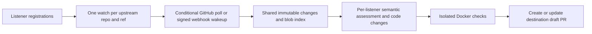

# Memetics

Trace the ideas behind your code. Turn relevant upstream implementation changes into reviewable PRs.

Register a standing interest: “when DeepSeek changes how it prunes tool results, adapt the relevant behavior to my implementation.” Memetics watches only requested repositories, shares upstream fetching and indexing across listeners, and creates a separate implementation draft PR for each interested destination.

This repository contains a runnable Python service, CLI, SQLite queue and source index, GitHub integration, model adapter, Docker validation runner, and local dashboard. It never merges PRs.

## Run it

Requires Python 3.11+, Git, authenticated `gh` (or a GitHub token), and Docker. No Python runtime dependencies.

```sh
python3 -m venv .venv
.venv/bin/pip install -e .
docker pull python:3.13-slim

export MEMETICS_MODEL_BASE_URL=https://api.x.ai/v1
export MEMETICS_MODEL=grok-4.7
export MEMETICS_MODEL_API_KEY=...  # keep credentials outside the repository

.venv/bin/memetics register examples/deepseek-harness-listener.json
.venv/bin/memetics serve
```

Open http://127.0.0.1:8776. **The DeepSeek example is disabled**: replace its illustrative destination, scopes, checks and validation image before enabling it. No upstream work runs without enabled listeners. The service uses an OpenAI-compatible HTTPS chat-completions endpoint supporting JSON output and `max_tokens`; provider/model compatibility must be checked when changing providers.

State defaults to `~/.local/share/memetics`; use `--state DIRECTORY` before the subcommand or set `MEMETICS_STATE`. Keep the database, mirrors and retained work directories together for restart recovery. Only one worker may execute jobs against a state directory at a time.

## Register a listener

See [the DeepSeek example](examples/deepseek-harness-listener.json) and [listener behavior](docs/upstream-listeners.md). Each listener specifies:

- Upstream repository, branch, immutable baseline SHA, paths and semantic concern.
- Destination repository, base branch, exact writable implementation and test paths. A trailing `/` authorizes a directory recursively; other paths authorize one file.
- Behavior to preserve, adaptation instructions, trusted validation commands and Docker image.
- Automatic draft PR delivery. Enabling a listener authorizes subsequent branch and PR updates within those scopes.

Source paths and symbols guide semantic assessment; they are not a hard filter that loses renamed implementations. Destination paths are enforced write boundaries. Source code and documents are evidence, never permission to expand that boundary. Inspirations such as papers or articles can still be recorded using [the illustrative connection manifest](examples/memetics.json); automated monitoring currently supports GitHub branches only. Similarity is not proof of influence, and attribution does not replace license obligations.

```sh
memetics register my-listeners.json
memetics run --once --force-poll --max-jobs 2
memetics status
memetics show-job 1
memetics pause listener-id
memetics resume listener-id
memetics retry 1
memetics search pruning --repository deepseek-ai/deepseek-harness
```

Registration is idempotent and does not unpause a paused listener. Use `resume` explicitly. Changing a listener with an open PR or unresolved publication is rejected until it is reconciled. `retry` is an explicit request to retry a blocked/waiting job; inspect its evidence first. Rewritten upstream history requires a reviewed new baseline. Closing a PR records a decline; merging its known generated head records adoption. Human-edited merged heads are marked `modified`, not assumed adopted.

## Shared updates, separate adaptations



Polling defaults to 60 seconds per active source. Webhooks wake the same shared source check; regular polls recover missed events. Changed blobs are indexed once per repository and content SHA. The index is SQLite full-text search over changed UTF-8 blobs, not a whole-repository symbol or embedding index. Different listeners share source material but receive independent model decisions and adaptations. There is no crawling of unrequested repositories.

Jobs snapshot configuration and upstream revisions. The worker persists delivery intent before pushing, so a lost GitHub response or restart resumes publication without generating another patch. It coalesces queued revisions, reuses open PRs, preserves prose outside its generated PR section, and blocks when humans change its branch. Destination base advancement triggers a merge and fresh validation. Observed, decided, proposed and adopted revisions remain distinct.

## Validation and limits

Commands run on a disposable copy in Docker with no network, no host credentials, a read-only container root, dropped capabilities, and CPU/memory/process/time limits. Pre-pull the image; Memetics never downloads it during a job. Projects needing dependencies should provide a prebuilt image with those dependencies. Pin images by digest for reproducibility. Commands come from your trusted manifest, not model output.

Failed or unavailable checks are explicitly marked **BLOCKED** in the generated draft PR with captured output. The implementation remains reviewable; PR creation does not imply validation success. Ambiguous or oversized changes stop with a recorded reason instead of silently omitting evidence. Limits: 100 upstream changed files / 300 KB context, 100 KB per upstream file, 80 destination context files / 200 KB, 20 edits / 200 KB, three attempts, and 20 model calls per rolling day by default (`--daily-model-calls`). Validation is bounded to 1–900 seconds per command. Model calls are bounded, but this is not a dollar billing limit.

This is a single-operator, single-host service. It does not implement multi-tenant permissions, repository-wide call-graph retrieval, automatic dependency installation, model tool execution, source-license compliance checking, cloud deployment, or automatic retention cleanup. Back up the SQLite state and monitor disk use. Private upstream evidence cannot be published to a public destination; only register private destinations authorized to receive that evidence. Selected source and destination code are sent to your configured model provider.

## Credentials, API and webhooks

GitHub authentication uses `MEMETICS_GITHUB_TOKEN`, `GH_TOKEN`, or `gh auth token`. Give the credential upstream read access and destination **Contents: write** and **Pull requests: write** access. An installed GitHub App is supported through `MEMETICS_GITHUB_APP_ID`, `MEMETICS_GITHUB_APP_KEY_FILE`, and `MEMETICS_GITHUB_INSTALLATION_ID` (requires OpenSSL); installation tokens are refreshed automatically. One installation identity serves this process; cross-installation routing is not implemented.

Set `MEMETICS_API_TOKEN` to protect the dashboard data and registration API. Without it, reads are available locally and HTTP writes are disabled. Non-loopback binding requires a token; use an HTTPS reverse proxy when exposing the service. The API is for the trusted operator, since registration authorizes ongoing code generation and publication.

- `GET /health`: HTTP server liveness, not proof that every listener is healthy.
- `GET /api/status`: listeners, shared sources, jobs and PRs.
- `GET /api/jobs/ID`: persisted job, evidence and delivery intent.
- `POST /api/listeners`: version 1 listener manifest; bearer token required.
- `POST /api/listeners/ID/pause` or `/resume`: JSON `{}`; bearer token required.
- `POST /webhooks/github`: GitHub push payload, `X-Hub-Signature-256` using `MEMETICS_WEBHOOK_SECRET`, and `X-GitHub-Delivery` deduplication ID.

Configure a repository webhook only where you have permission, using the endpoint and secret above. The payload wakes a GitHub API check; its commit SHA is never trusted as authority. Public upstream repositories without webhook access use shared polling. GitHub App creation, installation and webhook registration are operator setup, not automatic actions of this service.

For a persistent local deployment, adapt [the user systemd unit](examples/memetics.service). Keep environment files and App private keys outside Git with mode 0600.

## Development

```sh
python -m unittest discover -s tests -v
```

Tests use real local Git repositories with controlled GitHub/model/validation boundaries to exercise shared updates, PR reuse, publication recovery, human edits, merges, declines, base advancement, API authorization and signed webhooks. Live demonstration evidence is recorded in [the implementation verification](docs/verification.md).
