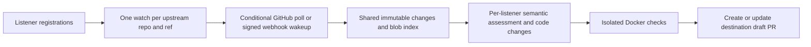

# Memetics

Trace the ideas behind your code. Turn relevant upstream implementation changes into reviewable PRs.

Register a standing interest: “when DeepSeek changes how it prunes tool results, adapt the relevant behavior to my implementation.” Memetics watches only requested repositories, shares upstream fetching and indexing across listeners, and creates a separate implementation draft PR for each interested destination.

This repository contains a runnable Rust service and CLI: SQLite queue and source index, GitHub integration, an OpenAI-compatible model adapter, a Docker validation runner, a local dashboard, a committed `memetics.md` idea manifest with edit-stable anchors, and an idea-drift check for commits. It never merges PRs.

## Run it

Requires a Rust toolchain (1.88+), Git, authenticated `gh` (or a GitHub token), and Docker.

```sh
cargo install --path .
docker pull python:3.13-slim

export MEMETICS_MODEL_BASE_URL=https://api.x.ai/v1
export MEMETICS_MODEL=grok-4.7
export MEMETICS_MODEL_API_KEY=...  # keep credentials outside the repository

memetics register examples/deepseek-harness-listener.json
memetics serve
```

Open http://127.0.0.1:8776. **The DeepSeek example is disabled**: replace its illustrative destination, scopes, checks and validation image before enabling it. No upstream work runs without enabled listeners. The service uses an OpenAI-compatible HTTPS chat-completions endpoint supporting JSON output and `max_tokens`; provider/model compatibility must be checked when changing providers.

State defaults to `~/.local/share/memetics`; use `--state DIRECTORY` or set `MEMETICS_STATE`. Keep the database, mirrors and retained work directories together for restart recovery. Only one worker may execute jobs against a state directory at a time. The SQLite schema is the Python implementation's plus one additive table (`idea_verdicts`), and canonical JSON digests are byte-identical, so an existing state directory keeps working.

## Register a listener

See [the DeepSeek example](examples/deepseek-harness-listener.json) and [listener behavior](docs/upstream-listeners.md). Each listener specifies:

- Upstream repository, branch, immutable baseline SHA, paths and semantic concern.
- Destination repository, base branch, exact writable implementation and test paths. A trailing `/` authorizes a directory recursively; other paths authorize one file.
- Behavior to preserve, adaptation instructions, trusted validation commands and Docker image.
- Automatic draft PR delivery. Enabling a listener authorizes subsequent branch and PR updates within those scopes.

Source paths guide semantic assessment; they are not a hard filter that loses renamed implementations. When `upstream.symbols` is set (qualified names such as `ToolResultPruner.pruneContent`), an adaptation is triggered only when the normalised hash of one of those upstream symbols changes; other upstream edits are recorded as `unchanged` with no model call. Destination paths are enforced write boundaries. Source code and documents are evidence, never permission to expand that boundary. Inspirations such as papers, articles and upstream code are recorded in [`memetics.md`](#memeticsmd-where-each-idea-lives); automated monitoring currently supports GitHub branches only. Similarity is not proof of influence, and attribution does not replace license obligations.

```sh
memetics register my-listeners.json
memetics run --once --force-poll --max-jobs 2
memetics status
memetics show-job 1
memetics pause listener-id
memetics resume listener-id
memetics retry 1
memetics search pruning --repository deepseek-ai/deepseek-harness
```

Registration is idempotent and does not unpause a paused listener. Use `resume` explicitly. Changing a listener with an open PR or unresolved publication is rejected until it is reconciled. `retry` is an explicit request to retry a blocked/waiting job; inspect its evidence first. Rewritten upstream history requires a reviewed new baseline. Closing a PR records a decline; merging its known generated head records adoption. Human-edited merged heads are marked `modified`, not assumed adopted.

## Shared updates, separate adaptations



Polling defaults to 60 seconds per active source. Webhooks wake the same shared source check; regular polls recover missed events. Changed blobs are indexed once per repository and content SHA. The index is SQLite full-text search over changed UTF-8 blobs, not a whole-repository symbol or embedding index. Different listeners share source material but receive independent model decisions and adaptations. There is no crawling of unrequested repositories.

The adaptation step is a bounded agent in the shape of PortGPT: each turn it may read a file at the new upstream revision, read or grep the destination checkout, run the trusted validation commands on a proposed patch (scope-enforced, then reset), or finish with a decision. It has at most 8 turns, each counted against `--daily-model-calls`. Actions are plain JSON replies, so no provider-side tool calling is needed. When the triggering symbols are known, it first decides whether behaviour relevant to the listener's concern changed; a no records the model's reason instead of opening a PR.

Jobs snapshot configuration and upstream revisions. The worker persists delivery intent before pushing, so a lost GitHub response or restart resumes publication without generating another patch. It coalesces queued revisions, reuses open PRs, preserves prose outside its generated PR section, and blocks when humans change its branch. Destination base advancement triggers a merge and fresh validation. Observed, decided, proposed and adopted revisions remain distinct.

## Validation and limits

Commands run on a disposable copy in Docker with no network, no host credentials, a read-only container root, dropped capabilities, and CPU/memory/process/time limits. Pre-pull the image; Memetics never downloads it during a job. Projects needing dependencies should provide a prebuilt image with those dependencies. Pin images by digest for reproducibility. Commands come from your trusted manifest, not model output.

Failed or unavailable checks are explicitly marked **BLOCKED** in the generated draft PR with captured output. The implementation remains reviewable; PR creation does not imply validation success. Ambiguous or oversized changes stop with a recorded reason instead of silently omitting evidence. Limits: 100 upstream changed files / 300 KB context, 100 KB per upstream file or lookup, 80 destination context files / 200 KB, 20 edits / 200 KB, 8 agent turns per attempt, three attempts, and 20 model calls per rolling day by default (`--daily-model-calls`). Validation is bounded to 1–900 seconds per command. Model calls are bounded, but this is not a dollar billing limit.

This is a single-operator, single-host service. It does not implement multi-tenant permissions, repository-wide call-graph retrieval, automatic dependency installation, model tool execution, source-license compliance checking, cloud deployment, or automatic retention cleanup. Back up the SQLite state and monitor disk use. Private upstream evidence cannot be published to a public destination; only register private destinations authorized to receive that evidence. Selected source and destination code are sent to your configured model provider.

## Credentials, API and webhooks

GitHub authentication uses `MEMETICS_GITHUB_TOKEN`, `GH_TOKEN`, or `gh auth token`. Give the credential upstream read access and destination **Contents: write** and **Pull requests: write** access. An installed GitHub App is supported through `MEMETICS_GITHUB_APP_ID`, `MEMETICS_GITHUB_APP_KEY_FILE`, and `MEMETICS_GITHUB_INSTALLATION_ID` (requires OpenSSL); installation tokens are refreshed automatically. One installation identity serves this process; cross-installation routing is not implemented.

Set `MEMETICS_API_TOKEN` to protect the dashboard data and registration API. Without it, reads are available locally and HTTP writes are disabled. Non-loopback binding requires a token; use an HTTPS reverse proxy when exposing the service. The API is for the trusted operator, since registration authorizes ongoing code generation and publication.

- `GET /health`: HTTP server liveness, not proof that every listener is healthy.
- `GET /api/status`: listeners, shared sources, jobs and PRs.
- `GET /api/jobs/ID`: persisted job, evidence and delivery intent.
- `POST /api/listeners`: version 1 listener manifest; bearer token required.
- `POST /api/listeners/ID/pause` or `/resume`: JSON `{}`; bearer token required.
- `POST /webhooks/github`: GitHub push payload, `X-Hub-Signature-256` using `MEMETICS_WEBHOOK_SECRET`, and `X-GitHub-Delivery` deduplication ID.

Configure a repository webhook only where you have permission, using the endpoint and secret above. The payload wakes a GitHub API check; its commit SHA is never trusted as authority. Public upstream repositories without webhook access use shared polling. GitHub App creation, installation and webhook registration are operator setup, not automatic actions of this service.

For a persistent local deployment, adapt [the user systemd unit](examples/memetics.service). Keep environment files and App private keys outside Git with mode 0600.

## memetics.md: where each idea lives

Each repository can carry a `memetics.md` at its root that records the ideas it implements, where they came from, and the code that implements them. It is plain Markdown with a strict structure: free prose before the first `## `, then one section per idea with fixed bullets.

```markdown
## shared-watch
- idea: One conditional poll per upstream repository and ref is shared by every listener.
- source: code swh:1:rev:77bb8cc…;origin=https://github.com/GeorgePearse/memetics;path=/memetics/engine.py;lines=56-84 repo=https://github.com/GeorgePearse/memetics symbol=Engine.poll hash=5adb9f6a2561e3df
- source: paper arXiv:2510.22396 section="PortGPT agent"
- source: paper doi:10.1145/3597503.3639187
- source: article https://swhid.org/specification
- code: src/engine.rs symbol=Engine::poll hash=4f6ef89bedb1c5f5 lines=247-286
```

- `idea` (exactly one): the statement the code must keep implementing.
- `source` (any number): `code` with a [SWHID](https://swhid.org/specification) (the `lines` qualifier is only a citation hint) plus the upstream repo, symbol and anchor hash; `paper` with `doi:` or `arXiv:` and an optional `section`; or `article` with a URL. `memetics cite OWNER/REPO` prints the DOI/arXiv id from an upstream `CITATION.cff` or `codemeta.json`, and `memetics cite OWNER/REPO --path P --symbol S [--ref R]` prints a SWHID-anchored code source.
- `code` (at least one): a path plus a tree-sitter `symbol` (qualified as `Type::method` in Rust and `Class.method` in Python/TypeScript/JavaScript). The anchor is `hash`, the first 16 hex characters of a blake3 hash of the symbol's normalised text: comments and formatting are dropped and the definition's own name is masked. `lines` is only a display hint. Omit `symbol` to anchor a whole file. Values containing spaces are double-quoted.

`render(parse(file)) == file` for a well-formed manifest, so tools can rewrite it without disturbing prose.

```sh
memetics ideas                 # list ideas, sources and anchors
memetics ideas --check         # same place / moved or renamed / changed / lost; non-zero on drift
memetics ideas --fix           # update line hints and moved or renamed anchors
memetics ideas --rehash        # fill missing hashes and accept current content
memetics locate src/judge.rs:500   # which idea covers this line?
```

Resolving an anchor: an exact hash hit under the same symbol means the code is in the same place; a hash hit under another symbol or file means it was moved or renamed; a symbol hit with a different hash means it was edited; neither means it is lost. There is no history-based matcher. This repository's own [`memetics.md`](memetics.md) records memetics' ideas and links each Rust symbol to the Python function it was ported from.

## Idea-drift checks on commits

`memetics check-commit REV`, `memetics check-commit BASE..HEAD`, or `memetics check-commit --staged` finds the diff hunks that overlap an anchored symbol (resolved at the base revision) and classifies each affected idea as `same_idea`, `refines_idea`, `different_idea` or `removes_idea`:

1. **Structural check first.** If the normalised hash at the head equals the base hash, the verdict is `same_idea` with no model call. That covers formatting, comment and line-shift edits, and pure renames or moves, which also update the anchor (`--update-anchors` rewrites `memetics.md`, and stages it with `--staged`). If `difft` is installed, `difft --check-only --exit-code` is consulted as well; it is never required.
2. **Judge only on a real change.** The judge receives the idea statement, upstream symbols, the before and after code, and the overlapping hunks. It must cite the anchor id, the hunk ids it judged and, for upstream-linked ideas, the upstream symbol. A verdict without evidence is an error (exit 2), not a pass.
3. **Policy.** The check fails (exit 1) only for `different_idea` or `removes_idea` at or above `--threshold` (default 0.7), and only if that idea's `memetics.md` section was not changed in the same range. `refines_idea` warns; with `--strict-refines` it requires an amendment.

Verdicts are stored in the `idea_verdicts` table against the revision range, with `method` = `cheap` or `judge`, and a repeated check reuses the stored judge verdict. Output is `--format text|json|markdown`.

The judge is pluggable. By default (`MEMETICS_JUDGE=jev`) it is [Jev](https://typesafe.ai) through the Vercel AI Gateway's evaluation-model API: typed choices with calibrated probabilities, using `AI_GATEWAY_API_KEY` or `MEMETICS_JUDGE_API_KEY`. With `MEMETICS_JUDGE=chat`, any OpenAI-compatible chat model is used through the same adapter as adaptations, at temperature 0. The default is OpenRouter `typesafe/jev-router` with `OPENROUTER_API_KEY`, and `MEMETICS_JUDGE_BASE_URL` / `MEMETICS_JUDGE_MODEL` override it.

- `memetics install-hook` installs a `pre-commit` hook (`check-commit --staged --update-anchors`); use `--kind post-commit` for a non-blocking report.
- [`.github/workflows/idea-drift.yml`](.github/workflows/idea-drift.yml) runs the check on pull requests that touch idea code and comments the verdicts. It needs an `AI_GATEWAY_API_KEY` repository secret and is skipped without one.

## Related work

- [PortGPT](https://arxiv.org/abs/2510.22396) (IEEE S&P 2026; [code](https://github.com/OS3Lab/patch-backporting)) is the model for the adaptation agent: an LLM with on-demand code lookup and compiler/test feedback. Memetics scopes it to anchored symbols and always opens a draft.
- [Cohere vllm-skills](https://github.com/cohere-ai/vllm-skills) ([write-up](https://cohere.com/blog/automating-fork-maintenance-with-ai-agents)) closes a similar loop for a whole fork: detect an upstream release, rebase, health-check, human review. Memetics does this per idea rather than per fork.
- [Swimm Auto-sync](https://docs.swimm.io/features/keep-docs-updated-with-auto-sync/) re-anchors documentation snippets as code changes. Memetics uses a simpler, history-free symbol-plus-normalised-hash anchor and fails when an idea changes, not only when a snippet is lost.
- [difftastic](https://github.com/Wilfred/difftastic) is the optional structural prefilter. The required fallback is the tree-sitter normalised hash.
- [SWHID](https://swhid.org/specification) (ISO/IEC 18670) identifies upstream code sources (`swh:1:rev:…;path=…`). Because a SWHID line range does not survive edits, each code source also carries its own symbol-plus-hash anchor.

## Development

```sh
cargo fmt --check && cargo clippy --all-targets -- -D warnings && cargo test
AI_GATEWAY_API_KEY=… cargo test --test live_jev -- --ignored --nocapture   # live Jev, ~$0.0001
```

Tests use real local Git repositories with controlled GitHub/model/validation boundaries. They exercise shared updates, PR reuse, publication recovery, human edits, merges, declines, base advancement, API authorization and signed webhooks. They also cover symbol-hash triggers, agent tools, anchor resolution, manifest round-trips and the idea-drift policy. Live demonstration evidence is recorded in [the implementation verification](docs/verification.md).
